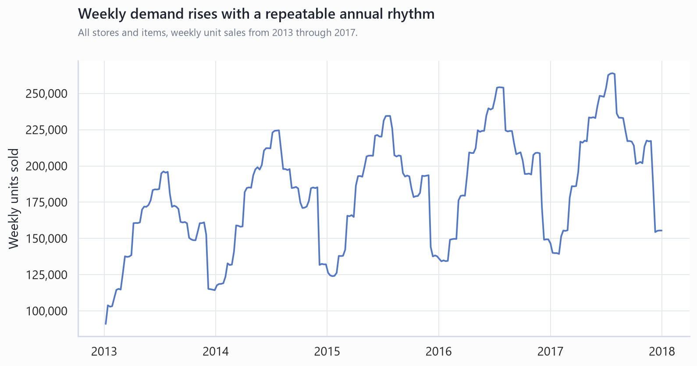
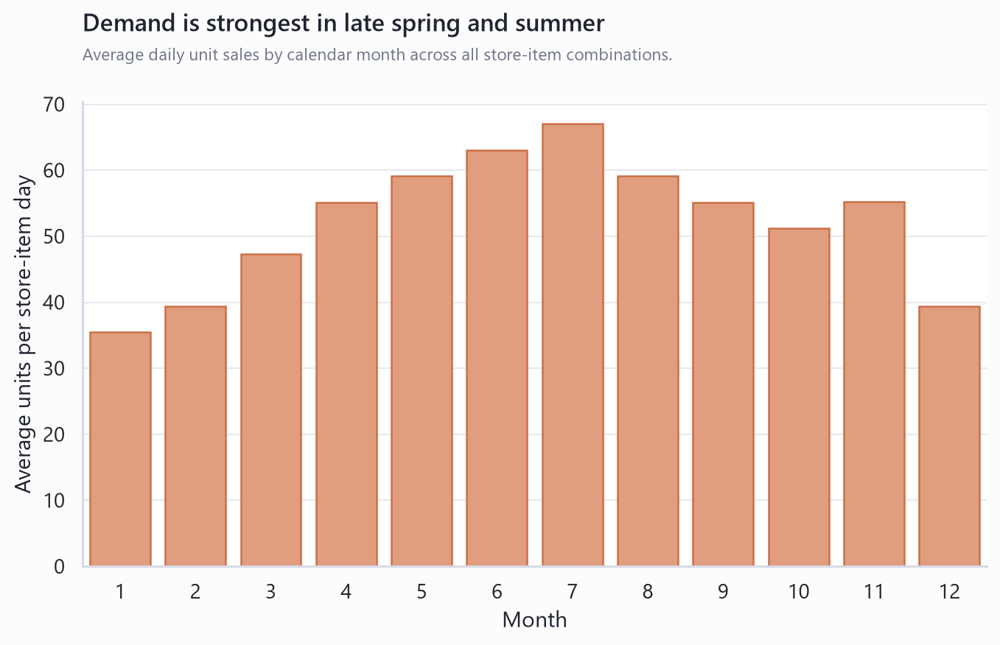
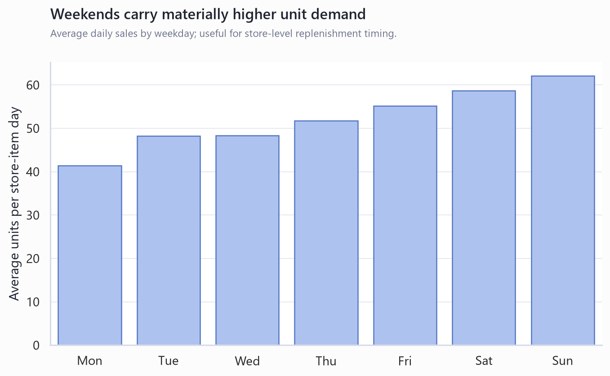
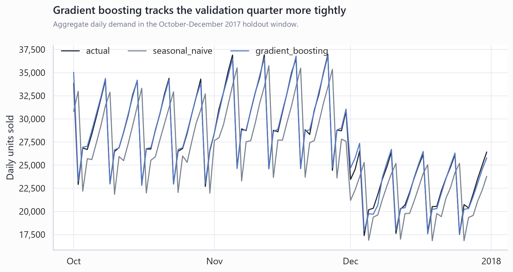
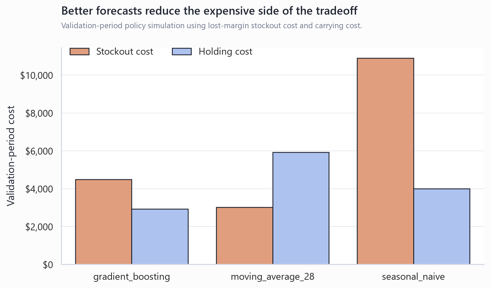

# Retail Demand Forecasting & Inventory Optimization

## 1. Problem Framing

**Manual or naive replenishment leaves money on both sides of the shelf.**

This project uses the Kaggle Store Item Demand Forecasting Challenge dataset:
913,000 daily observations across 10 stores,
50 items, and five years. The business question is practical:
how much better does a store-item forecast need to be before it changes reorder
decisions?

Baseline assumption: the retailer currently uses a same-day-last-year forecast
as a proxy for manual seasonal reordering.

Validation-period baseline cost:

- Stockout cost: $10,905
- Holding cost: $3,997
- Reorder admin cost: $245,000
- Total operating cost: $259,902

## 2. Key Drivers

**The data is seasonal, but not flat enough for one blanket safety-stock rule.**

The demand curve shows a repeatable yearly pattern, with clear weekday lift and
meaningful differences by store and item. Store 2 has
the highest total demand in the training set, while item 15
is the highest-volume item overall.

## 3. Forecasting Results

**A feature-based model beats the seasonal naive baseline on the holdout quarter.**

The validation window is October 1, 2017 through December 31, 2017. The stronger
model is a gradient boosting regressor using calendar features, store/item ids,
rolling demand, and lagged sales. The baseline is same-day-last-year demand.

- Seasonal naive WMAPE: 19.9%
- Gradient boosting WMAPE: 11.0%
- WMAPE improvement: 8.9 percentage points
- Gradient boosting RMSE: 7.77 units per store-item day

## 4. Cost Of Inaction

**Forecast error becomes expensive when it is converted into stockout exposure.**

Using the same reorder logic, the modeled policy reduces validation-period
operating cost by **$7,486**, or **2.9%**, versus the
seasonal naive policy. The largest dollars sit in lost gross margin from unmet
demand, not in the short-run carrying cost.

## 5. Intervention Options

**Option A: SKU-level dynamic safety stock**

- Most targeted option; changes reorder points where forecast uncertainty is high.
- Best fit for items with high volatility or high margin exposure.
- Requires store-item level monitoring and periodic recalibration.

**Option B: Store-level forecasting**

- Easier to explain and operate.
- Useful for labor planning or aggregate replenishment.
- Too blunt for item-level stockout prevention.

**Option C: Centralized forecast with store allocation**

- Best long-term operating model if the retailer can pool demand signals.
- Supports allocation logic across stores when supply is constrained.
- Needs richer data than this Kaggle file: inventory, price, promotions,
  supplier lead time, and store constraints.

## 6. Recommendation And ROI

**Start with SKU-level dynamic safety stock for the top-risk store-item pairs.**

The first rollout should focus on the series with both high demand volatility
and high forecast error. The hardest validation series is store
7, item 5, with CV
0.35 and MAPE 30.6%.

Expected base-case impact under the model assumptions:

- Average recommended safety stock: 32.8 units per store-item
- Average reorder point: 416.1 units per store-item
- Validation-period modeled savings: $7,486
- Main ROI lever: fewer lost-margin stockouts without blindly raising inventory everywhere

## 7. Appendix: Methodology And Caveats

**Methodology**

- Cleaned and validated the Kaggle training data at date-store-item grain.
- Profiled store, item, weekday, monthly, and annual seasonality patterns.
- Decomposed total daily demand with `statsmodels` to separate trend,
  seasonality, and residual variation.
- Compared seasonal naive, 28-day moving average, and gradient boosting models.
- Translated forecast uncertainty into safety stock using a 95% service level
  and a 7-day lead-time assumption.

**Caveats**

- The dataset has observed sales, not true demand. Stockouts could hide demand.
- There are no price, margin, promotion, holiday, weather, competitor, or
  inventory-on-hand fields.
- Lag features in the validation run represent a daily reforecast process after
  recent sales are known; a long-horizon frozen forecast would need recursive
  simulation.
- Dollar results are assumption-driven and should be replaced with retailer
  finance data before a real business case.

**Assumptions to confirm before external use**

- Actual item prices, gross margins, and landed costs.
- Supplier lead times, order minimums, pack sizes, and reorder admin cost.
- Target service level by SKU tier.
- Whether the business wants to value stockouts as lost margin, lost revenue,
  customer churn risk, or a blended penalty.
